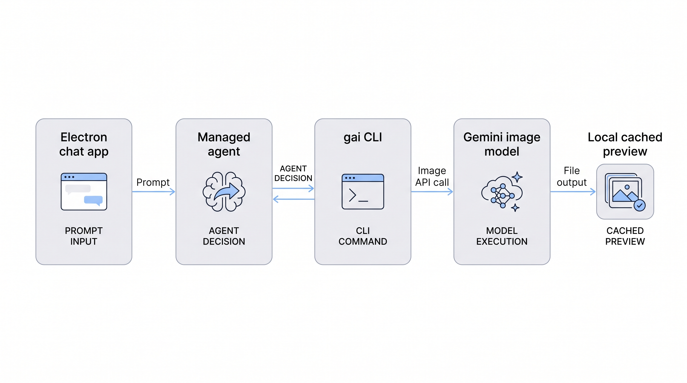

# Building a Managed Agent That Can Generate Media

This sample shows a small but useful pattern: one chat app talks to one persistent Gemini Managed Agent, and that agent becomes the runtime container for work. It can reason, browse, code, inspect files, and call a specialized CLI only when the user asks for media.

The scenario below follows one request: a user asks the app to create an image. The same routing pattern now covers image, video, TTS, music generation, and audio transcription.



The diagram asset was generated through this project using the Gemini 3.1 Flash Image route. The current Gemini image docs describe Nano Banana 2 as `gemini-3.1-flash-image` and Nano Banana Pro as `gemini-3-pro-image`; Pro is the higher-end model for professional assets, while Flash Image is the efficient default for most image requests. See Google's [Nano Banana image generation docs](https://ai.google.dev/gemini-api/docs/image-generation).

## What This Sample Is

Gemini Anything Agent has three pieces:

- **Electron chat app**: the local UI, conversation list, sample prompts, output panel, previews, and managed-agent client.
- **Gemini Managed Agent**: the remote Linux sandbox that handles the work and keeps conversation/environment continuity.
- **`@lyalindotcom/gai` CLI**: the media wrapper around the GenAI SDK for image, video, TTS, music, and transcription.

The app is not a media generator by itself. The managed agent is not asked to memorize every media API shape. Instead, the app gives the managed agent a tiny tool surface:

```bash
bash /.agents/bin/gai --help
bash /.agents/bin/gai image "a cozy product shot of a tiny robot assistant" --out /workspace/output/robot.jpg --json
```

The agent uses that CLI only for specialized media work. For normal text, coding, research, analysis, and file transformations, the agent uses its native managed-agent capabilities.

## The Image Flow

When the user asks, "make me an image of a cat," this is what happens:

1. The Electron app checks that a Gemini API key is configured.
2. On the first run, the app creates or refreshes the managed agent.
3. The app sends the user message to that one agent.
4. The app includes continuity settings, so follow-up turns can reuse the same interaction context and sandbox files.
5. The agent reads its system prompt and skill instructions.
6. The agent decides the request is new image generation.
7. The agent runs `/.agents/bin/gai image ...`.
8. `gai` calls the Gemini image model through the GenAI SDK.
9. The image is written to `/workspace/output`.
10. The app downloads and caches the output locally.
11. The chat shows an inline preview, and the output panel exposes the saved file. HTML opens in a sandboxed in-app preview; Markdown and text files open in a read-only in-app viewer.

The important design choice is that generated artifacts live in `/workspace/output`. The app can treat that folder as the handoff surface between the remote agent and the local UI.

## Wrapping the GenAI SDK

The `gai image` command is intentionally thin. It chooses a model, calls the GenAI SDK, decodes the returned base64 image, and writes a file.

This is the core idea in copyable form:

```ts
import { GoogleGenAI } from "@google/genai";
import { writeFile } from "node:fs/promises";

const ai = new GoogleGenAI({
  apiKey: process.env.GEMINI_API_KEY
});

export async function generateImage(prompt: string, out = "image.jpg") {
  const interaction = await ai.interactions.create({
    model: process.env.GEMINI_IMAGE_MODEL ?? "gemini-3.1-flash-image",
    input: prompt,
    response_format: {
      type: "image",
      mime_type: "image/jpeg",
      aspect_ratio: "1:1",
      image_size: "1K"
    }
  } as never);

  const image = (interaction as any).output_image;
  if (!image?.data) {
    throw new Error("The image model did not return output_image.data");
  }

  await writeFile(out, Buffer.from(image.data, "base64"));
  return out;
}
```

The published sample package is [`@lyalindotcom/gai`](https://www.npmjs.com/package/@lyalindotcom/gai). In the managed-agent sandbox, the wrapper script runs it with `npx`:

```bash
exec npx -y "${GEMINI_ANYTHING_NPM_PACKAGE:-@lyalindotcom/gai}@${GEMINI_ANYTHING_NPM_VERSION:-latest}" "$@"
```

That lets the agent stay stable while the CLI package can be updated independently.

The same wrapper owns the specialized audio routes:

```bash
bash /.agents/bin/gai tts "Say hello in a warm voice." --out /workspace/output/hello.wav --json
bash /.agents/bin/gai music "A short upbeat instrumental theme song." --out /workspace/output/theme.mp3 --json
bash /.agents/bin/gai transcribe /workspace/output/podcast.mp3 --out /workspace/output/podcast-transcript.md --json
```

TTS is for spoken audio and podcast-style narration. Music is for songs, loops, instrumental beds, and theme tracks. Transcription starts from an existing audio file and writes a transcript file instead of pasting the whole transcript into chat.

## Creating the Managed Agent

The app builds the managed agent definition from local files in `agents/` and deploys it through the Managed Agents API. Google's managed-agent docs describe the runtime as a configurable agent harness with a Linux sandbox for code execution, files, and web work; see the [Agents overview](https://ai.google.dev/gemini-api/docs/agents) and the launch post on [Managed Agents in the Gemini API](https://blog.google/innovation-and-ai/technology/developers-tools/managed-agents-gemini-api/).

Here is a minimal standalone TypeScript version of the same shape. Replace the system prompt and skill text with your own instructions.

```ts
const API_BASE = "https://generativelanguage.googleapis.com/v1beta";
const API_REVISION = "2026-05-20";
const AGENT_ID = process.env.GEMINI_ANYTHING_AGENT_ID ?? "gemini-anything-v1";
const GAI_PACKAGE = process.env.GEMINI_ANYTHING_NPM_PACKAGE ?? "@lyalindotcom/gai";
const GAI_VERSION = process.env.GEMINI_ANYTHING_NPM_VERSION ?? "latest";

const apiKey = process.env.GEMINI_API_KEY;
if (!apiKey) {
  throw new Error("Set GEMINI_API_KEY before creating the agent.");
}

const gaiWrapper = `#!/usr/bin/env bash
set -euo pipefail
if [ -f /.env ]; then set -a; . /.env; set +a; fi
export NODE_USE_ENV_PROXY="\${NODE_USE_ENV_PROXY:-1}"
exec npx -y "\${GEMINI_ANYTHING_NPM_PACKAGE:-${GAI_PACKAGE}}@\${GEMINI_ANYTHING_NPM_VERSION:-${GAI_VERSION}}" "$@"
`;

const systemInstruction = `
You are Gemini Anything Agent.
Use native managed-agent tools for text, code, research, analysis, and file work.
Use /.agents/bin/gai only for new image, video, text-to-speech, music, and transcription work.
When creating files, save them under /workspace/output and report the path.
If the user refers to an existing artifact, inspect /workspace/output first.
`;

const skillText = `
# Gemini Anything Skill

Use bash /.agents/bin/gai --help to discover the available media commands.
Run the relevant subcommand help before using image, video, tts, music, or transcribe.

For image generation, run:

bash /.agents/bin/gai image "<prompt>" --out /workspace/output/image.jpg --json

For music generation, run:

bash /.agents/bin/gai music "<prompt>" --out /workspace/output/theme.mp3 --json

For transcription, write a Markdown transcript file and report the path. Do not paste the full transcript into chat unless asked.

Keep user-facing prompts clean. Put technical output-path instructions in the skill or system prompt, not in sample user prompts.
`;

const agent = {
  id: AGENT_ID,
  base_agent: "antigravity-preview-05-2026",
  system_instruction: systemInstruction,
  tools: [
    { type: "code_execution" },
    { type: "google_search" },
    { type: "url_context" }
  ],
  base_environment: {
    type: "remote",
    sources: [
      {
        type: "inline",
        target: ".agents/bin/gai",
        content: gaiWrapper
      },
      {
        type: "inline",
        target: ".agents/skills/gemini-anything/SKILL.md",
        content: skillText
      },
      {
        type: "inline",
        target: ".env",
        content: [
          `GEMINI_API_KEY=${apiKey}`,
          `GEMINI_ANYTHING_NPM_PACKAGE=${GAI_PACKAGE}`,
          `GEMINI_ANYTHING_NPM_VERSION=${GAI_VERSION}`,
          "GEMINI_ANYTHING_MUSIC_MODEL=lyria-3-clip-preview",
          ""
        ].join("\n")
      }
    ]
  }
};

const response = await fetch(`${API_BASE}/agents`, {
  method: "POST",
  headers: {
    "Content-Type": "application/json",
    "x-goog-api-key": apiKey,
    "x-goog-api-revision": API_REVISION
  },
  body: JSON.stringify(agent)
});

if (!response.ok) {
  throw new Error(await response.text());
}

console.log(await response.json());
```

This proof of concept mounts a plaintext `.env` into the remote sandbox so the CLI can make Gemini API calls. That is simple for a sample, but it is not a production secret-management design.

## Sending the User Request

After the agent exists, the app sends each chat turn to the same managed agent. The key fields are the agent id, the user input, and the continuity pointers.

```ts
const request = {
  agent: "gemini-anything-v1",
  input: "Create a square image of a tiny robot assistant brewing coffee.",
  previous_interaction_id: previousInteractionId,
  environment: previousEnvironmentId ?? { type: "remote" },
  background: true,
  store: true
};

const response = await fetch(`${API_BASE}/interactions`, {
  method: "POST",
  headers: {
    "Content-Type": "application/json",
    "x-goog-api-key": process.env.GEMINI_API_KEY!,
    "x-goog-api-revision": API_REVISION
  },
  body: JSON.stringify(request)
});
```

In the app, those continuity controls are exposed under Options:

- Conversation continuity reuses the previous interaction id.
- Environment continuity reuses the sandbox and its files.

That is what makes a follow-up like "make the same image more cinematic" or "download the image from the output folder" possible without asking the user to restate everything.

## Why This Shape Works

The managed agent is good at deciding, sequencing, inspecting files, and doing normal work. The CLI is good at hiding specialized media API details. The Electron app is good at local UX: chat history, sample prompts, previews, downloads, file panels, and cache behavior.

Keeping those roles separate gives you a cleaner sample:

- The app does not need one-off branches for every model capability.
- The agent can discover `gai --help` instead of guessing model names.
- The CLI can evolve as Gemini media APIs evolve.
- The user gets one chat surface for many kinds of output.

## Boundaries

- This is an unofficial proof of concept.
- It uses your Gemini API key and can trigger real API spend.
- The sample `.env` flow is plaintext and intentionally simple.
- The managed agent can perform multi-step work, so use this pattern carefully.

For the runnable package, see [`@lyalindotcom/gai` on npm](https://www.npmjs.com/package/@lyalindotcom/gai). For current music model details, see Google's [Lyria 3 music generation docs](https://ai.google.dev/gemini-api/docs/music-generation).
